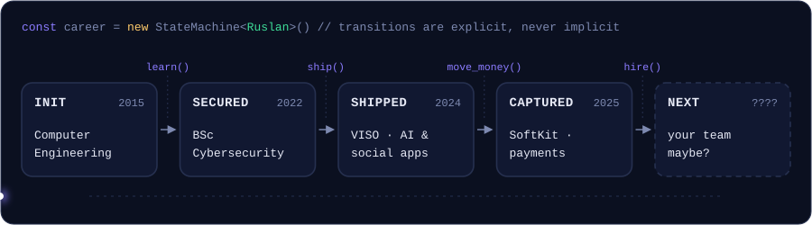

<p align="center">
  
</p>

<p align="center">
  <a href="mailto:ruslan.voshchylo2@gmail.com"></a>
  <a href="https://www.linkedin.com/in/ruslan-voshchylo-5060522a9/"></a>
  <a href="https://t.me/rvoshchylo"></a>
</p>

<p align="center">
  
  
  
  
</p>

---

### `GET /about`

```http
HTTP/1.1 200 OK
Content-Type: application/json
X-Handled-By: ruslan-voshchylo
```
```jsonc
{
  "role": "Full-Stack Developer",          // backend-leaning
  "currently": "SoftKit",                   // 07/2025 → now
  "domain": ["payments", "subscription billing", "integrations"],
  "beliefs": [
    "every webhook will be delivered twice — handle it once",
    "state transitions are explicit or they are bugs",
    "if it fails, it should fail loudly"
  ],
  "also_ships": "LLM-backed features with structured output + graceful degradation",
  "studying": "MSc Cybersecurity"
}
```

### `GET /career` &nbsp;<sub>— modelled the only way I know: as a state machine</sub>

<p align="center">
  
</p>

---

### `GET /events?limit=2` &nbsp;<sub>— experience, as a webhook log</sub>

<details open>
<summary><code>🟢 role.active</code> &nbsp;<b>SoftKit</b> — Full-Stack Developer &nbsp;·&nbsp; <i>07/2025 → present</i></summary>
<br />

| `event.type` | What happened |
| --- | --- |
| `payment.flow.migrated` | Vehicle sales flow **v2**: Safepay v2 migration, deal payment service on an **explicit state machine**, financing & manual payments, **zero-downtime** v1 compatibility |
| `insurance.module.created` | Car insurance **from scratch**: external API, Stripe checkout & webhooks, certificates, admin invoicing — **PCI DSS** compliant |
| `billing.stripe.integrated` | Subscriptions, promo codes, refunds, **idempotent webhooks**, automated invoices |
| `crm.sync.bidirectional` | **Pipedrive** two-way sync, **Twilio** SMS, email/IP deliverability monitoring (Spamhaus, IPQS) → **Slack** alerts |
| `jobs.background.scheduled` | Ownership monitoring, debt checks, auto-delisting — heavy work moved off the request cycle |
| `admin.tools.shipped` | Price adjustments, document uploads, user verification, invoicing |
| `frontend.modules.shipped` | Insurance purchase flow, multi-step deal stepper, subscription UI, image editor (crop · rotate · drag-and-drop) |
| `platform.hardened` | **Vitest** added to CI/CD · **Node 20 → 24** + Terraform updates — CVEs closed, faster runtime |

</details>

<details>
<summary><code>⚪ role.completed</code> &nbsp;<b>VISO</b> — Full-Stack Developer &nbsp;·&nbsp; <i>2024 → 2025 · Lviv</i></summary>
<br />

| `event.type` | What happened |
| --- | --- |
| `ai.assignments.generated` | **Teach Aid** — assignment generation on the **OpenAI API**: prompt design, structured output parsing, fallbacks for malformed/failed responses |
| `auth.implemented` | NestJS auth (JWT + refresh tokens), Google OAuth, email sign-up with auto-generated profiles |
| `api.crud.shipped` | REST API on **Prisma + PostgreSQL**, RBAC, multi-school support, class management |
| `social.platform.launched` | **Tripami** — travel journaling & community: media upload pipeline, recommendations, following, sharing tips |

</details>

---

### `GET /stack`

| layer | tools |
| :-- | :-- |
| **backend** | <br /><sub>TypeORM · REST · OpenAPI/Swagger · Passport.js · JWT</sub> |
| **frontend** | <br /><sub>Zustand · React Hook Form · Zod · Ant Design · React Router · Recharts · dnd-kit</sub> |
| **cloud & ops** | <br /><sub>SQS · Lambda · CI/CD · Sentry</sub> |
| **money & messages** |         |
| **quality** | <br /><sub>AI-assisted development with Claude Code</sub> |

---

### `GET /education`

```diff
+ 2024 → now    MSc · Cybersecurity                        Ternopil Ivan Puluj National Technical University
+ 2022 → 2024   BSc · Cybersecurity                        Ternopil Ivan Puluj National Technical University
+ 2015 → 2020   Junior Specialist · Computer Engineering   Technical College of TNTU
```

### `GET /metrics`

<p align="center">
  
</p>
<p align="center">
  
</p>

---

<p align="center">
  
</p>
